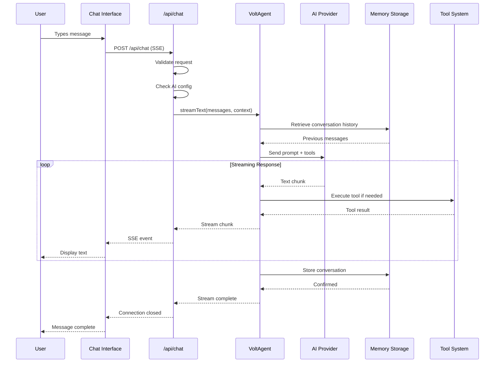
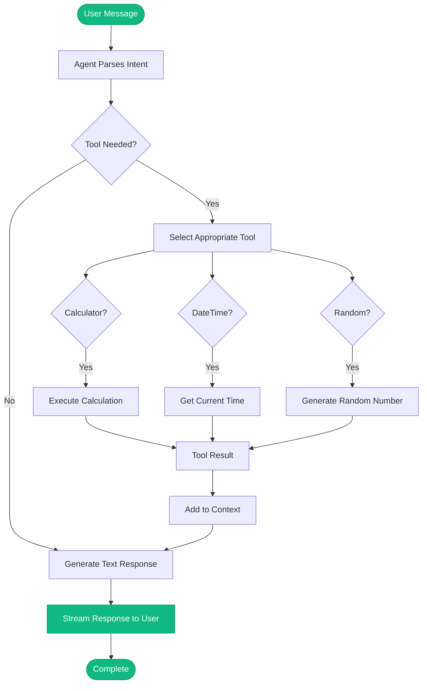
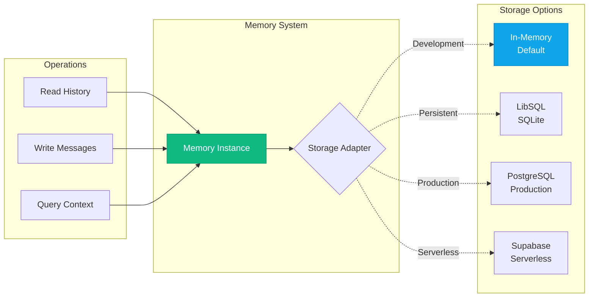
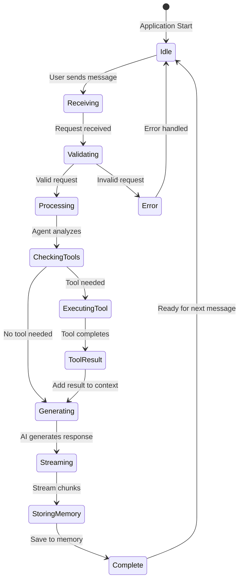
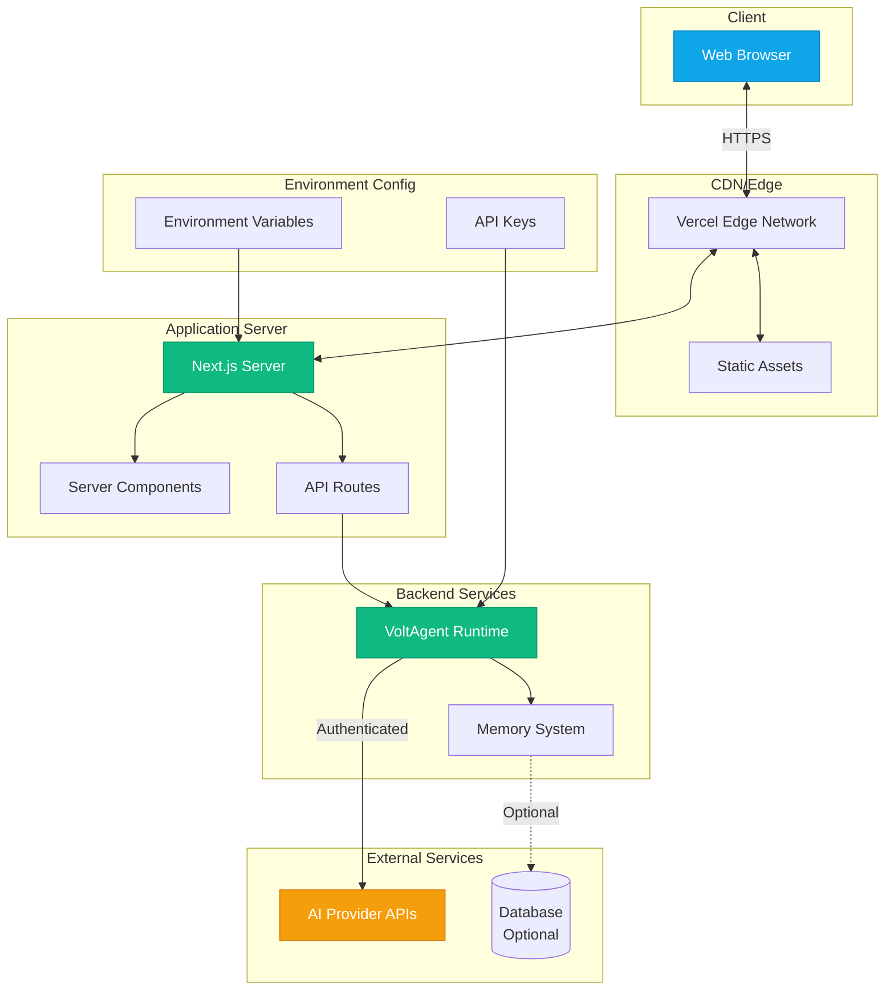

<div align="center">
<a href="https://voltagent.dev/">

</a>

<br/>
<br/>

<div align="center">
    <a href="https://voltagent.dev">Home Page</a> |
    <a href="https://voltagent.dev/docs/">Documentation</a> |
    <a href="https://github.com/voltagent/voltagent/tree/main/examples">Examples</a> |
    <a href="https://s.voltagent.dev/discord">Discord</a> |
    <a href="https://voltagent.dev/blog/">Blog</a>
</div>
</div>

<br/>

# Next.js Chatbot Starter Template

A production-ready chatbot application built with Next.js 15, VoltAgent, and the Vercel AI SDK. This template provides a complete foundation for building sophisticated AI-powered conversational interfaces with streaming responses, tool integration, and multi-provider support.

## Features

- **Production-Ready Architecture** - Complete chatbot UI and backend infrastructure ready for deployment
- **Real-Time Streaming** - Server-sent events (SSE) streaming with the Vercel AI SDK for responsive interactions
- **Conversation Memory** - Configurable memory system with in-memory storage (with optional persistent storage adapters)
- **Tool Integration** - Pre-built tools for calculations, date/time queries, and random number generation
- **VoltOps Console** - Built-in debugging and monitoring with singleton VoltAgent instance (port 3141)
- **Modern Interface** - Responsive chat UI with VoltAgent branding and dark theme
- **TypeScript Support** - Fully typed codebase for enhanced developer experience and code safety
- **Extensible Design** - Clean architecture with modular components for easy customization
- **Multi-Provider AI** - Built-in support for OpenAI, Anthropic, Google AI, and Groq with environment-based configuration
- **Scalable Structure** - Organized codebase following Next.js App Router best practices

## Use Cases

- **Rapid Prototyping** - Build and test conversational AI applications quickly
- **Hackathon Projects** - Get a functional chatbot running in minutes
- **Learning Resource** - Understand VoltAgent integration patterns with Next.js
- **Production Foundation** - Start with a solid base and scale to production requirements
- **AI Integration Testing** - Experiment with different AI providers and configurations

## Architecture Overview

## Architecture Overview

### System Architecture

```mermaid
graph TB
    subgraph "Client Layer"
        UI[Chat Interface Component]
        UC[useChat Hook - AI SDK]
    end

    subgraph "API Layer"
        API[/api/chat Route]
        VAL[Request Validation]
        AUTH[AI Config Validation]
    end

    subgraph "Agent Layer"
        AGENT[VoltAgent Chatbot Agent]
        MEM[Memory System]
        TOOLS[Tool Registry]
    end

    subgraph "AI Provider Layer"
        OPENAI[OpenAI]
        ANTHROPIC[Anthropic]
        GOOGLE[Google AI]
        GROQ[Groq]
    end

    subgraph "Storage Layer"
        INMEM[In-Memory Storage]
        LIBSQL[(LibSQL Database)]
        POSTGRES[(PostgreSQL)]
    end

    UI --> UC
    UC -->|POST /api/chat| API
    API --> VAL
    VAL --> AUTH
    AUTH --> AGENT
    AGENT --> MEM
    AGENT --> TOOLS
    AGENT -->|API Call| OPENAI
    AGENT -->|API Call| ANTHROPIC
    AGENT -->|API Call| GOOGLE
    AGENT -->|API Call| GROQ
    MEM -.->|Current| INMEM
    MEM -.->|Optional| LIBSQL
    MEM -.->|Optional| POSTGRES
    AGENT -->|SSE Stream| API
    API -->|Response Stream| UC
    UC --> UI

    style UI fill:#10b981,stroke:#059669,color:#fff
    style AGENT fill:#10b981,stroke:#059669,color:#fff
    style API fill:#0ea5e9,stroke:#0284c7,color:#fff
```

### Request Flow



### Tool Execution Flow



### Core Components

**VoltAgent Integration**

- Pre-configured agent with memory and tool capabilities
- Singleton pattern implementation for optimal Next.js integration
- Example tools demonstrating common use cases (calculator, date/time, random numbers)

**API Infrastructure**

- `/api/chat` - Streaming chat endpoint with Vercel AI SDK compatibility
- Server-sent events (SSE) for real-time response streaming
- Proper error handling and validation

**User Interface**

- Modern chat interface with message bubbles and role-based styling
- Tool execution visualization with real-time feedback
- Comprehensive loading states and error handling
- Auto-scrolling message container for optimal UX
- Fully responsive design optimized for mobile and desktop
- VoltAgent branded theme with dark color scheme

### Technical Stack

- **Framework**: Next.js 15 (App Router)
- **AI Framework**: VoltAgent Core
- **AI SDK**: Vercel AI SDK v5
- **Styling**: Tailwind CSS 4
- **Language**: TypeScript 5
- **Package Manager**: npm/pnpm/yarn

## Getting Started

## Getting Started

### Prerequisites

- Node.js 20 or higher
- npm, pnpm, or yarn package manager
- API key from at least one supported AI provider

### Installation Methods

#### Option 1: Using Create VoltAgent App (Recommended)

The fastest way to get started is using the official VoltAgent CLI:

```bash
npm create voltagent-app@latest -- --example next-js-chatbot-starter-template
cd next-js-chatbot-starter-template
```

#### Option 2: Manual Setup

#### Option 2: Manual Setup

**Step 1: Clone the repository**

```bash
git clone https://github.com/voltagent/voltagent.git
cd voltagent/examples/next-js-chatbot-starter-template
```

**Step 2: Install dependencies**

```bash
npm install
# or
pnpm install
# or
yarn install
```

**Step 3: Configure environment variables**

Create your local environment file:

```bash
cp .env.example .env.local
```

Edit `.env.local` and configure your AI provider:

```env
# Select your AI provider
AI_PROVIDER=openai

# Add your API key (required)
OPENAI_API_KEY=sk-your-actual-api-key-here
```

**Obtaining API Keys:**

- **OpenAI**: https://platform.openai.com/api-keys
- **Anthropic**: https://console.anthropic.com/settings/keys
- **Google AI**: https://aistudio.google.com/app/apikey
- **Groq**: https://console.groq.com/keys

**Step 4: Start the development server**

```bash
npm run dev
```

**Step 5: Access the application**

Open your browser and navigate to [http://localhost:3000](http://localhost:3000)

## Configuration

## Configuration

### AI Provider Support

This template includes built-in support for multiple AI providers, allowing you to switch between them using environment variables without code changes.

#### Supported Providers

| Provider      | Models                           | Documentation                                           |
| ------------- | -------------------------------- | ------------------------------------------------------- |
| **OpenAI**    | gpt-4o, gpt-4o-mini, gpt-4-turbo | [Get API Key](https://platform.openai.com/api-keys)     |
| **Anthropic** | claude-3-5-sonnet, claude-3-opus | [Get API Key](https://console.anthropic.com/)           |
| **Google AI** | gemini-2.0-flash, gemini-1.5-pro | [Get API Key](https://makersuite.google.com/app/apikey) |
| **Groq**      | llama-3.3-70b, mixtral-8x7b      | [Get API Key](https://console.groq.com/keys)            |

#### Provider Configuration

**1. Set your AI provider in `.env.local`:**

```env
AI_PROVIDER=anthropic  # Options: openai, anthropic, google, groq
```

**1. Set your AI provider in `.env.local`:**

```env
AI_PROVIDER=anthropic  # Options: openai, anthropic, google, groq
```

**2. Add the corresponding API key:**

```env
# For Anthropic
ANTHROPIC_API_KEY=sk-ant-your-key-here

# For Google AI
GOOGLE_API_KEY=your-google-key-here

# For Groq
GROQ_API_KEY=gsk_your-groq-key-here
```

**3. (Optional) Override the default model:**

```env
ANTHROPIC_MODEL=claude-3-5-sonnet-20241022
GOOGLE_MODEL=gemini-1.5-pro
GROQ_MODEL=mixtral-8x7b-32768
```

The agent will automatically use your selected provider without requiring code changes.

#### Default Models

- **OpenAI**: `gpt-4o-mini`
- **Anthropic**: `claude-3-5-sonnet-20241022`
- **Google AI**: `gemini-2.0-flash-exp`
- **Groq**: `llama-3.3-70b-versatile`

### Memory Storage Options

By default, this template uses **in-memory storage** for conversation history. This provides simplicity and reliability during development, though conversations will be cleared on server restart.

**Current Configuration (In-Memory):**

```typescript
import { InMemoryStorageAdapter, Memory } from "@voltagent/core";

export const sharedMemory = new Memory({
  storage: new InMemoryStorageAdapter(),
});
```

**Persistent Storage Options:**

For production deployments requiring conversation persistence, you can configure alternative storage adapters:

**LibSQL (SQLite):**

```typescript
import { LibSQLMemoryAdapter } from "@voltagent/libsql";

export const sharedMemory = new Memory({
  storage: new LibSQLMemoryAdapter({
    url: "file:./.voltagent/memory.db",
  }),
});
```

**PostgreSQL:**

```typescript
import { PostgresMemoryAdapter } from "@voltagent/postgres";

export const sharedMemory = new Memory({
  storage: new PostgresMemoryAdapter({
    connectionString: process.env.DATABASE_URL,
  }),
});
```

**Supabase:**

```typescript
import { SupabaseMemoryAdapter } from "@voltagent/supabase";

export const sharedMemory = new Memory({
  storage: new SupabaseMemoryAdapter({
    url: process.env.SUPABASE_URL,
    apiKey: process.env.SUPABASE_ANON_KEY,
  }),
});
```

Modify `lib/agent/memory.ts` to implement your preferred storage solution.

### Component Interaction

```mermaid
graph TB
    subgraph "Frontend Components"
        PAGE[page.tsx<br/>Root Page]
        CHAT[chat-interface.tsx<br/>Main UI]
        USECHAT[useChat Hook<br/>AI SDK]
    end

    subgraph "API Layer"
        CHAT_API[/api/chat/route.ts<br/>Streaming Endpoint]
    end

    subgraph "Library Layer"
        AI_CONFIG[lib/ai/config.ts<br/>Provider Selection]
        AGENT_DEF[lib/agent/agent.ts<br/>Agent Definition]
        MEMORY_CFG[lib/agent/memory.ts<br/>Storage Config]
        TOOLS_REG[lib/tools/index.ts<br/>Tool Registry]
    end

    subgraph "Tool Implementations"
        CALC[calculator.ts]
        TIME[datetime.ts]
        RAND[random.ts]
    end

    subgraph "Type Definitions"
        TYPES[lib/types/api.ts<br/>TypeScript Types]
    end

    PAGE --> CHAT
    CHAT --> USECHAT
    USECHAT <-->|HTTP Stream| CHAT_API
    CHAT_API --> AI_CONFIG
    CHAT_API --> AGENT_DEF
    AGENT_DEF --> MEMORY_CFG
    AGENT_DEF --> TOOLS_REG
    AGENT_DEF --> AI_CONFIG
    TOOLS_REG --> CALC
    TOOLS_REG --> TIME
    TOOLS_REG --> RAND
    TYPES -.->|Type Safety| CHAT_API
    TYPES -.->|Type Safety| CHAT

    style CHAT fill:#10b981,stroke:#059669,color:#fff
    style AGENT_DEF fill:#10b981,stroke:#059669,color:#fff
    style CHAT_API fill:#0ea5e9,stroke:#0284c7,color:#fff
```

### Memory Architecture



### Data Flow



## Project Structure

```
next-js-chatbot-starter-template/
├── app/
│   ├── api/
│   │   └── chat/
│   │       └── route.ts              # Streaming chat endpoint with AI SDK integration
│   ├── components/
│   │   └── chat-interface.tsx        # Main chat UI component
│   ├── layout.tsx                    # Root layout with metadata
│   ├── page.tsx                      # Home page
│   └── globals.css                   # Global styles and theme
├── lib/
│   ├── ai/
│   │   └── config.ts                 # Multi-provider AI configuration
│   ├── agent/
│   │   ├── agent.ts                  # Chatbot agent definition
│   │   ├── memory.ts                 # Memory adapter configuration
│   │   └── index.ts                  # Agent exports
│   ├── tools/
│   │   ├── calculator.ts             # Calculator tool implementation
│   │   ├── datetime.ts               # Date/time utility tool
│   │   ├── random.ts                 # Random number generator tool
│   │   └── index.ts                  # Tools registry and exports
│   ├── types/
│   │   └── api.ts                    # TypeScript type definitions
│   └── utils/
│       └── api.ts                    # API utility functions
├── public/
│   └── voltagent.png                 # VoltAgent logo asset
├── .env.example                      # Environment variables template
├── .gitignore                        # Git ignore configuration
├── package.json                      # Project dependencies and scripts
├── tsconfig.json                     # TypeScript configuration
└── README.md                         # Project documentation
```

## Customization Guide

### Adding Custom Tools

Create a new tool file in `lib/tools/`:

### Adding Custom Tools

Create a new tool file in `lib/tools/`:

```typescript
// lib/tools/weather.ts
import { createTool } from "@voltagent/core";
import { z } from "zod";

export const weatherTool = createTool({
  name: "getWeather",
  description: "Get current weather for a location",
  parameters: z.object({
    location: z.string().describe("City name or coordinates"),
    units: z.enum(["celsius", "fahrenheit"]).optional(),
  }),
  execute: async ({ location, units = "celsius" }) => {
    // Implement weather API call
    return {
      temperature: 22,
      condition: "sunny",
      location,
    };
  },
});
```

Register the tool in `lib/tools/index.ts`:

```typescript
export { weatherTool } from "./weather";

import { calculatorTool } from "./calculator";
import { dateTimeTool } from "./datetime";
import { randomNumberTool } from "./random";
import { weatherTool } from "./weather";

export const defaultTools = [
  calculatorTool,
  dateTimeTool,
  randomNumberTool,
  weatherTool, // Add your new tool
];
```

### Extending API Routes

Create additional API endpoints in `app/api/`:

```typescript
// app/api/status/route.ts
import { NextResponse } from "next/server";

export async function GET() {
  return NextResponse.json({
    status: "operational",
    timestamp: new Date().toISOString(),
  });
}
```

### Customizing Agent Behavior

Modify the agent configuration in `lib/agent/agent.ts`:

### Customizing Agent Behavior

Modify the agent configuration in `lib/agent/agent.ts`:

```typescript
import { Agent } from "@voltagent/core";
import { getAIModel } from "../ai/config";
import { sharedMemory } from "./memory";
import { defaultTools } from "../tools";

export const chatbotAgent = new Agent({
  name: "CustomAssistant",
  instructions: `You are a specialized assistant with expertise in...
  
  Your capabilities include:
  - [List your capabilities]
  - [Additional features]
  
  Guidelines:
  - Be concise and helpful
  - Use tools when appropriate
  - [Custom guidelines]`,
  model: getAIModel(),
  tools: defaultTools,
  memory: sharedMemory,
  temperature: 0.7, // Adjust creativity (0.0 - 2.0)
  maxTokens: 1000, // Control response length
});
```

### Styling and Theming

**Modifying the Chat Interface:**

Edit `app/components/chat-interface.tsx` for UI customizations:

```typescript
// Change primary colors
className = "bg-emerald-500"; // User messages
className = "bg-[#0f2a26]"; // Assistant messages
className = "bg-[#0a1f1c]"; // Background

// Customize message bubbles
className = "rounded-2xl px-4 py-3";

// Adjust layout
className = "max-w-4xl mx-auto"; // Change max width
```

**Global Styles:**

Modify `app/globals.css` for theme-wide changes:

```css
:root {
  --primary-color: #10b981; /* emerald-500 */
  --background: #0a1f1c;
  --foreground: #ffffff;
}
```

## Available Scripts

## Available Scripts

```bash
# Development
npm run dev          # Start development server with hot reload
npm run build        # Build optimized production bundle
npm run start        # Start production server
npm run lint         # Run ESLint for code quality checks
npm run type-check   # Run TypeScript compiler checks
```

## VoltOps Console Debugging

This template includes VoltOps console support for debugging and monitoring your AI agents in real-time.

### Features

- **Real-time Agent Monitoring** - View agent execution traces and performance metrics
- **Tool Invocation Tracking** - Debug tool calls and responses
- **Memory Inspection** - Examine conversation history and memory state
- **OpenTelemetry Integration** - Comprehensive observability out of the box

### Accessing VoltOps Console

1. **Start the development server:**

   ```bash
   npm run dev
   ```

2. **VoltOps server starts automatically on port 3141**
   - The singleton VoltAgent instance ensures the debugging port opens correctly
   - Console URL: `http://localhost:3141`

3. **Implementation Details:**
   The template uses a singleton pattern to ensure the VoltOps debugging server persists across Next.js hot reloads:

   ```typescript
   // lib/agent/index.ts
   function getVoltAgentInstance() {
     if (!globalThis.voltAgentInstance) {
       globalThis.voltAgentInstance = new VoltAgent({
         agents: { chatbotAgent },
         server: honoServer(),
       });
     }
     return globalThis.voltAgentInstance;
   }
   ```

### Why Singleton Pattern?

In Next.js development mode, hot module replacement can cause multiple VoltAgent instances to be created, leading to:

- Port 3141 conflicts
- Multiple debugging servers
- Inconsistent trace data

The singleton pattern ensures a single VoltAgent instance across the application lifecycle, maintaining stable debugging capabilities.

### Troubleshooting VoltOps

**Port 3141 not opening:**

- Ensure `@voltagent/server-hono` is installed: `npm install @voltagent/server-hono`
- Check if another process is using port 3141: `lsof -ti:3141`
- Restart the development server

**Console not showing data:**

- Verify the agent is being used (make a chat request)
- Check browser console for WebSocket connection errors
- Ensure you're accessing `http://localhost:3141` (not https)

## API Reference

### POST /api/chat

Endpoint for streaming chat interactions with the AI agent.

**Request Body:**

```json
{
  "messages": [
    {
      "role": "user",
      "content": "Calculate 25 * 4",
      "id": "msg-abc123"
    }
  ],
  "conversationId": "conversation-id",
  "userId": "user-id"
}
```

**Request Parameters:**

- `messages` (required): Array of message objects with role, content, and optional ID
- `conversationId` (optional): Identifier for grouping related messages
- `userId` (optional): User identifier for tracking conversations

**Response:**
Server-Sent Events (SSE) stream containing:

- Text chunks for real-time streaming
- Tool invocation events
- Completion events

**Example cURL:**

```bash
curl -X POST http://localhost:3000/api/chat \
  -H "Content-Type: application/json" \
  -d '{
    "messages": [{
      "role": "user",
      "content": "What is the current time?"
    }],
    "conversationId": "test-conv",
    "userId": "test-user"
  }'
```

## Deployment

### Deployment Architecture



### Platform-Specific Guides

#### Vercel (Recommended)

Vercel provides the best integration with Next.js applications:

1. **Connect Repository:**
   - Push your code to GitHub, GitLab, or Bitbucket
   - Import the project in [Vercel Dashboard](https://vercel.com/new)

2. **Configure Environment Variables:**
   Navigate to Project Settings > Environment Variables and add:

   ```
   AI_PROVIDER=openai
   OPENAI_API_KEY=sk-your-api-key-here
   ```

3. **Deploy:**
   - Click "Deploy"
   - Vercel automatically detects Next.js and configures build settings
   - Your application will be live at `https://your-project.vercel.app`

#### Netlify

1. **Connect Repository** in Netlify Dashboard
2. **Build Settings:**
   - Build command: `npm run build`
   - Publish directory: `.next`
3. **Environment Variables:**
   Add in Site Settings > Build & Deploy > Environment
4. Enable Next.js Runtime in Netlify

#### Railway

1. Create new project from GitHub repository
2. Add environment variables in Variables tab
3. Railway automatically detects and deploys Next.js

#### Docker Deployment

```dockerfile
FROM node:20-alpine AS base

# Install dependencies
FROM base AS deps
WORKDIR /app
COPY package*.json ./
RUN npm ci

# Build application
FROM base AS builder
WORKDIR /app
COPY --from=deps /app/node_modules ./node_modules
COPY . .
RUN npm run build

# Production image
FROM base AS runner
WORKDIR /app
ENV NODE_ENV=production

COPY --from=builder /app/public ./public
COPY --from=builder /app/.next/standalone ./
COPY --from=builder /app/.next/static ./.next/static

EXPOSE 3000
ENV PORT 3000

CMD ["node", "server.js"]
```

### Required Environment Variables

All deployment platforms require these environment variables:

| Variable                       | Description                                                     | Required           |
| ------------------------------ | --------------------------------------------------------------- | ------------------ |
| `AI_PROVIDER`                  | AI provider selection (`openai`, `anthropic`, `google`, `groq`) | Yes                |
| `OPENAI_API_KEY`               | OpenAI API key                                                  | If using OpenAI    |
| `ANTHROPIC_API_KEY`            | Anthropic API key                                               | If using Anthropic |
| `GOOGLE_GENERATIVE_AI_API_KEY` | Google AI API key                                               | If using Google    |
| `GROQ_API_KEY`                 | Groq API key                                                    | If using Groq      |
| `OPENAI_MODEL`                 | Override default OpenAI model                                   | No                 |
| `ANTHROPIC_MODEL`              | Override default Anthropic model                                | No                 |
| `GOOGLE_MODEL`                 | Override default Google model                                   | No                 |
| `GROQ_MODEL`                   | Override default Groq model                                     | No                 |

## Troubleshooting

## Troubleshooting

### Common Issues

#### Invalid or Missing API Key

**Symptoms:**

- Error: "Incorrect API key provided"
- Error: "Invalid AI configuration"

**Resolution:**

1. Verify `.env.local` exists in project root (not `.env.example`)
2. Ensure API key is actual value, not placeholder:

   ```env
   # Incorrect - placeholder value
   OPENAI_API_KEY=your_openai_api_key_here

   # Correct - actual API key
   OPENAI_API_KEY=sk-proj-abc123xyz...
   ```

3. Restart development server after environment changes:
   ```bash
   # Stop server (Ctrl+C) then:
   npm run dev
   ```

#### Streaming/Parsing Errors

**Symptoms:**

- "Failed to parse stream string"
- Messages not appearing in UI

**Resolution:**

1. Hard refresh browser (Cmd+Shift+R on Mac, Ctrl+Shift+F5 on Windows)
2. Clear browser cache
3. Check browser console for detailed error messages
4. Verify AI provider API key is valid and has available credits

#### Hydration Warnings

**Symptoms:**

- Console warnings about hydration mismatches
- Mentions of `cz-shortcut-listen` or similar attributes

**Resolution:**

- These warnings are caused by browser extensions (ColorZilla, Grammarly, etc.)
- Not an application error - safe to ignore
- Already suppressed in `app/layout.tsx` with `suppressHydrationWarning`

#### Memory/Database Errors

**Symptoms:**

- "undefined cannot be passed as argument to the database"
- LibSQL connection errors

**Resolution:**

- Default configuration uses in-memory storage (no database required)
- If you enabled LibSQL:
  ```bash
  rm -rf .voltagent
  npm run dev
  ```
- Consider reverting to in-memory storage for development:

  ```typescript
  // lib/agent/memory.ts
  import { InMemoryStorageAdapter, Memory } from "@voltagent/core";

  export const sharedMemory = new Memory({
    storage: new InMemoryStorageAdapter(),
  });
  ```

#### Port Already in Use

**Symptoms:**

- Error: "Port 3000 is already in use"

**Resolution:**

```bash
# Find and kill process on port 3000
lsof -ti:3000 | xargs kill -9

# Or use alternative port
PORT=3001 npm run dev
```

#### Build Errors

**Symptoms:**

- TypeScript compilation errors
- Missing dependencies

**Resolution:**

```bash
# Clean install
rm -rf node_modules .next
npm install
npm run build
```

### Getting Help

If you encounter issues not covered here:

1. **Check Documentation:**
   - [VoltAgent Docs](https://voltagent.dev/docs/)
   - [Next.js Docs](https://nextjs.org/docs)
   - [AI SDK Docs](https://sdk.vercel.ai/docs)

2. **Community Support:**
   - [Discord Community](https://s.voltagent.dev/discord)
   - [GitHub Issues](https://github.com/voltagent/voltagent/issues)
   - [GitHub Discussions](https://github.com/voltagent/voltagent/discussions)

3. **Bug Reports:**
   When reporting issues, include:
   - Node.js version (`node --version`)
   - Package manager and version (`npm --version`)
   - Operating system
   - Error messages and stack traces
   - Steps to reproduce

## Performance Optimization

### Production Recommendations

1. **Enable Caching:**

```typescript
// next.config.ts
export default {
  experimental: {
    staleTimes: {
      dynamic: 30,
    },
  },
};
```

2. **Optimize Images:**

```typescript
// Use Next.js Image component
import Image from 'next/image';

<Image
  src="/voltagent.png"
  alt="VoltAgent"
  width={100}
  height={100}
  priority
/>
```

3. **Implement Rate Limiting:**

```typescript
// lib/utils/rate-limit.ts
export function rateLimit(identifier: string) {
  // Implement rate limiting logic
}
```

4. **Monitor Performance:**

- Use Vercel Analytics
- Implement error tracking (Sentry, LogRocket)
- Monitor AI provider API usage

## Security Considerations

1. **API Key Protection:**
   - Never commit `.env.local` or `.env` files
   - Use environment variables in deployment platforms
   - Rotate API keys regularly

2. **Input Validation:**
   - All user inputs are validated in API routes
   - Consider implementing content moderation for production

3. **Rate Limiting:**
   - Implement rate limiting to prevent abuse
   - Monitor API usage and costs

4. **CORS Configuration:**
   ```typescript
   // Only if needed for external API access
   export const config = {
     api: {
       cors: {
         origin: ["https://yourdomain.com"],
         methods: ["POST"],
       },
     },
   };
   ```

## Contributing

Contributions are welcome and appreciated! To contribute:

1. Fork the repository
2. Create a feature branch (`git checkout -b feature/amazing-feature`)
3. Commit your changes (`git commit -m 'Add amazing feature'`)
4. Push to the branch (`git push origin feature/amazing-feature`)
5. Open a Pull Request

Please ensure:

- Code follows existing style conventions
- All tests pass
- Documentation is updated
- Commit messages are clear and descriptive

## License

This project is licensed under the MIT License - see the [LICENSE](../../LICENSE) file for complete details.

## Resources

### Documentation

- [VoltAgent Documentation](https://voltagent.dev/docs/)
- [VoltAgent API Reference](https://voltagent.dev/docs/api)
- [Next.js Documentation](https://nextjs.org/docs)
- [Vercel AI SDK](https://sdk.vercel.ai/docs)
- [TypeScript Handbook](https://www.typescriptlang.org/docs/)

### Community

- [Discord Community](https://s.voltagent.dev/discord)
- [GitHub Repository](https://github.com/voltagent/voltagent)
- [Twitter/X](https://twitter.com/voltagent)

### Related Examples

- [VoltAgent Examples](https://github.com/voltagent/voltagent/tree/main/examples)
- [Next.js Examples](https://github.com/vercel/next.js/tree/canary/examples)

---

**Built by the VoltAgent Team**

For questions, feedback, or support, join our [Discord community](https://s.voltagent.dev/discord) or open an issue on [GitHub](https://github.com/voltagent/voltagent/issues).
