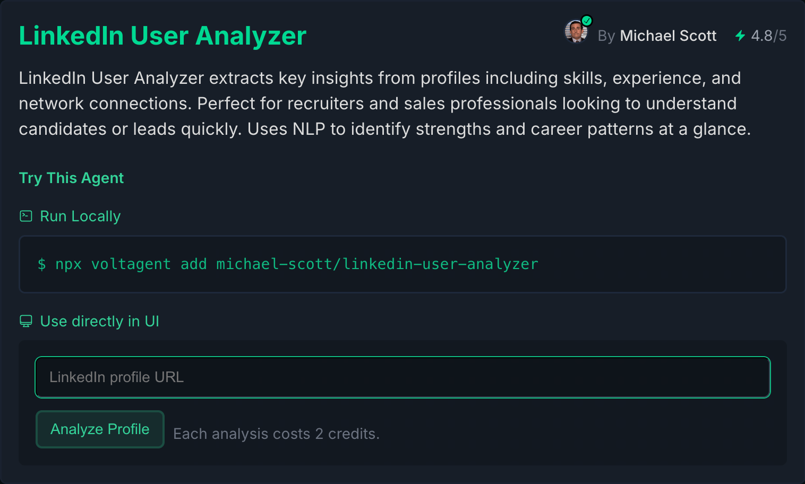

Just a few day back, we launched VoltAgent into the wild. Honestly, the energy and engagement from the community have blown us away.
We've already seen contributors jump in, a flood of interest, and folks starting to tackle real-world problems using VoltAgent.

We're seriously exploring our next big steps, one of is: [**The VoltAgent Community Marketplace**](/marketplace).
A place where community share or monetize their AI Agent built with VoltAgent Framework.

## Why open marketplace now?

I believe the next decade is going to be shaped by this 'AI agent economy'. But as this shift happens, it's clear that just having the coding frameworks isn't the whole story.

To truly unlock the potential here, we need better ways for the community to actually share creations.

That's precisely the goal behind the VoltAgent Community Marketplace: creating a home for agents built _with VoltAgent_, where open-source developers can discover, monetize, and grow together.

While major tech players are adopting agents (some even launching their own marketplaces), many platforms risk becoming closed gardens... Yet, there appears to be a gap. Many emerging platforms might be closed gardens. We think the **real innovation happens in the open**.

:::note Bridging the Gaps

- **Accesible Solutions:** Many users and businesses need reliable, ready-to-use agents. The marketplace connects them with community-built VoltAgent solutions, making adoption easier.
- **Making it Worthwhile:** The marketplace provides a path for developers to earn revenue from VoltAgent agents, supporting sustainable development.
- **Growing the Ecosystem:** A marketplace helps create specialized VoltAgent tools and components, making the whole framework better for everyone.
- **Spotlight on Builders:** Let's give talented VoltAgent developers a place to show off their amazing agents and get noticed.
  :::

A community marketplace, built on open principles, maybe able to bridge these gaps. And we believe developers should be at the heart of it.

## What We're Thinking

So we have some ideas for the VoltAgent Community Marketplace is a vibrant hub where you can:

- 🔄 **Share & Showcase:** Easily list your VoltAgent-based AI Agents creations, explain what they do, and how they work. Think of it as your agent's portfolio page.
- 🤝 **Discover & Reuse:** Find agents built by others, understand their capabilities, and integrate them into your own projects (or use them standalone!).
- 💰 **Monetize Your Work (Optional!):** Explore ways to help developers monetize their AI agents. We're considering models like subscriptions, pay-per-use.. What makes sense to you?
- 📊 **Build Trust & Reputation:** Gain credibility through user feedback, ratings, usage metrics, and contributions back to the community.
- Run it locally or try it instantly in the UI

## This is Where We Need You

The idea for a VoltAgent Community Marketplace is currently maturing but excited about the possibilities. Before the development ends, we need your help to shape it. Your feedback now is vital. Here are the kinds of questions we're asking ourselves:

- **Must-Have Features:** What would make a marketplace genuinely _useful_ for you, either as someone sharing an agent or someone looking for one?
- **Listing & Demo Needs:** How should agents be presented? What information is crucial? Should there be live demo options? Sandboxes?
- **Monetization Models:** If you _were_ to monetize, how would you prefer to do it? Subscriptions? Pay-per-use? Flat fees? What feels fair and encourages participation?
- **Potential Concerns:** What worries you? Security? Quality control? IP protection? Maintaining agent reliability? Let's talk about the challenges.
- **Motivation to Share:** What would genuinely make you _want_ to list your agent on the marketplace? What's the incentive beyond potential monetization?

Please jump into this **GitHub Discussion** [Link to Discussion - NEEDS A REAL LINK] and share your raw thoughts, big ideas, and nagging questions.
As a thank you, everyone who provides feedback there will get early access to list their agents if and when the marketplace goes live.

Let me know what you think!

Best,
Necati
