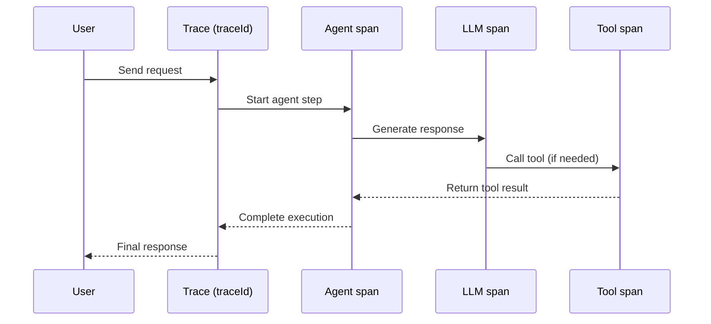

# Mental Model

This page shows the minimum mental model you need to open a VoltOps trace and understand what happened.
AI agents are hard to debug if you only look at final output.
VoltOps solves this by showing each run as a trace with step-level spans.

## One Request, One Trace

In VoltOps:

- A **trace** is one end-to-end execution.
- A **span** is one operation inside that execution.
- Spans are connected by parent-child relationships and rendered as nodes.
